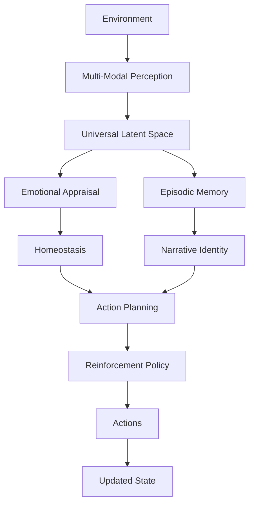

# shiva.ai
### An Open-Source Cognitive Architecture for Autonomous AI Systems

*"Building AI that doesn't just predict—it perceives, remembers, regulates, plans, and acts."*

---

## Why Shiva?
Artificial Intelligence has made tremendous progress in language understanding, image generation, and reasoning. While Large Language Models (LLMs) can write software and converse fluently, they remain fundamentally **reactive**.

They generate outputs conditioned on inputs, but they lack a continuously evolving internal cognitive state. They do not regulate themselves, possess intrinsic motivations, or maintain physiological balance. Most AI today behaves like an intelligent calculator rather than an autonomous cognitive agent. Shiva.ai is designed to explore a different direction.

## The Problem
Today's AI systems generally consist of a single reasoning engine surrounded by tools:

`Input` → `Large Language Model` → `Output`

In this paradigm, memory is often implemented as simple vector retrieval, planning is reduced to prompt engineering, and internal regulation is absent. Identity disappears after every interaction. The challenge is no longer just answering questions; the challenge is building AI that can **maintain itself**.

## Our Approach
Shiva models intelligence as a **cognitive control system** rather than a sequence prediction problem. Every action emerges from the continuous interaction of:
* **Perception**
* **Internal State**
* **Emotional Appraisal**
* **Homeostasis**
* **Memory**
* **Planning**
* **Decision Making**

This creates an agent whose behavior evolves over time, forming a closed cognitive feedback loop where memory changes emotion, emotion changes attention, and attention changes planning.

## Cognitive Pipeline

## Design Philosophy
Biological intelligence does not emerge from a single algorithm, but through the interaction of specialized systems. Our principles include:
* **Intelligence is an action-selection problem.**
* **Memory must influence future behavior.**
* **Emotion is an adaptive computational signal.**
* **Internal regulation is necessary for stability.**
* **Learning must be continuous and modular.**

## Core Concepts
* **Universal Latent Space:** Projects heterogeneous data (Text, Vision, Robotics, etc.) into a shared representation ($z \in \mathbb{R}^{512}$), allowing domain-agnostic reasoning.
* **Emotional Appraisal:** Emotions act as computational signals representing the significance of events, dynamically influencing attention and learning priority.
* **Homeostasis:** An internal model monitoring variables like *Energy*, *Arousal*, and *Safety* to maintain stability while pursuing goals.
* **Episodic Memory:** Stores experiences based on emotional salience and novelty, forming a persistent narrative identity.
* **Dual Policy Reinforcement Learning:** Employs multiple expert policies, dynamically blended based on the agent's internal state.

## Tech Stack
* **Deep Learning:** Transformers, Contrastive Learning, Hypernetwork Gating.
* **Reinforcement Learning:** Soft Actor-Critic (SAC), Prioritized Experience Replay.
* **Distributed Intelligence:** Swarm Cognition, Model Migration, Parameter Frankenmerging.

## Roadmap
* **Phase 1: Foundation (Complete)** — Transformer backbone, multi-modal alignment.
* **Phase 2: Decision Making (Complete)** — Dual Actor SAC, experience replay.
* **Phase 3: Cognitive Layer (Complete)** — Emotion, Homeostasis, Memory.
* **Phase 4: Autonomous Intelligence (In Progress)** — Long-horizon planning, multi-agent collaboration.

---

## Contributing
Shiva is an open-source research project. We welcome contributions in Deep Learning, Reinforcement Learning, Cognitive Science, and Robotics. 

## License
Released under the MIT License.

---
**Intelligence is more than prediction. It is perception, regulation, memory, adaptation, and action.**
