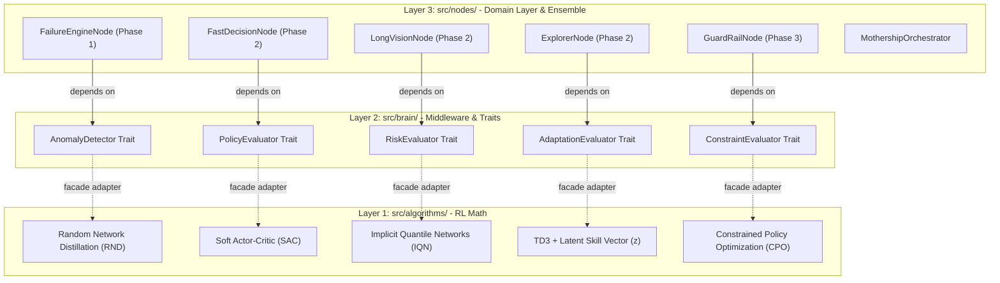
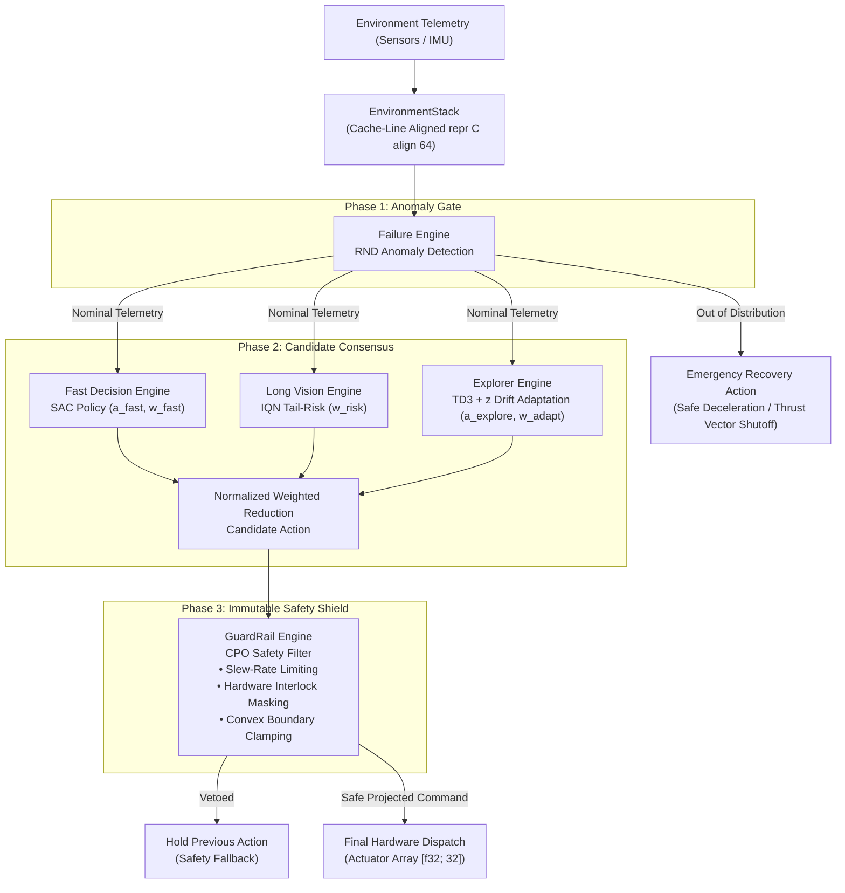

<div align="center">

# shiva.ai
### Sub-Millisecond Autonomous Runtime & Cognitive OS for Robotics, Rocketry & Real-Time Physical Hardware

*"Building AI that doesn't just predict—it perceives, regulates, projects safety, and acts in sub-millisecond real time for autonomous robots, rockets, drones, and physical actuators."*


</div>

---


# Why Shiva for Robotics & Rocketry?

Autonomous physical hardware—whether a **thrust-vectoring rocket engine**, a **quadruped robot**, an **autonomous drone**, or a **high-speed robotic manipulator**—demands control systems that fulfill three uncompromising requirements:

1. **Sub-Millisecond Execution**: Control loops must evaluate in microseconds to maintain stability (e.g., kilohertz gimbal adjustments or motor torque commands).
2. **Zero Latency Spikes (Zero Heap Allocations)**: Dynamic memory allocation (`malloc`, garbage collection) creates unpredictable latency spikes that cause catastrophic physical failures (e.g., rocket RUD or mechanical crash).
3. **Guaranteed Physical Safety Constraints**: Machine learning policies can hallucinate or output extreme actuator commands. Hardware demands hard interlocks, slew-rate limits, and convex boundary safety enforcement.

**Shiva 2.0** is an open-source framework designed specifically for real-time robotic and aerospace control systems. Written in Rust with native C-ABI export bindings, it seamlessly integrates into **Rust, C, C++, Python, ROS / ROS2**, and real-time embedded stacks.

---

# Example Use Case


https://github.com/user-attachments/assets/b06969f0-133d-4858-97a7-9d479e752aa8


https://github.com/user-attachments/assets/0a3f43a1-c365-4a7b-9844-04c36231ebfe


*From rocket gimbal stabilization & quadrotor landing to multi-joint robotic arm manipulation: Shiva ingests raw sensor telemetry, runs real-time anomaly detection, multi-policy consensus, and CPO safety projection to output deterministic motor commands.*

---

# Key Framework Capabilities

### ⚡ Sub-Millisecond & Zero-Allocation Execution
- **`#[repr(C, align(64))]` Memory Alignment**: `EnvironmentStack` memory buffers are cache-line aligned and stored statically or on the stack.
- **Zero Dynamic Heap Allocations**: Hot execution paths operate completely without `Vec` or `Box` allocations during real-time loops.
- **Microsecond Control Loop**: Tailored for high-frequency hardware systems operating at 100 Hz to 10 kHz.

### 🛡️ 3-Phase Safety Consensus Pipeline
1. **Phase 1: Anomaly Gate (Failure Engine / RND)**
   - Measures out-of-distribution state prediction error $E(S_t)$ in real time.
   - If an unexpected state occurs (e.g., sensor failure, extreme aerodynamic disturbance), it immediately **bypasses policy execution** and dispatches a pre-compiled safe emergency recovery action ($a_{\text{emergency}}$).
2. **Phase 2: Unconstrained Candidate Consensus**
   - **Fast Decision Engine (SAC)**: Computes baseline motor action $a_{\text{fast}}$ and confidence weight $w_{\text{fast}}$.
   - **Long Vision Engine (IQN)**: Computes multi-step tail risk (CVaR) to produce a risk-adjusted weight $w_{\text{risk}}$.
   - **Explorer Engine (TD3 + z)**: Decodes latent skill vectors $z \in \mathbb{R}^{16}$ to compensate for physical drift (e.g., mass loss, friction shift, wind gusts) yielding $a_{\text{explore}}$ and $w_{\text{adapt}}$.
   - **Normalized Reduction**: Combines proposals without torque loss or signal attenuation.
3. **Phase 3: Immutable Safety Shield (GuardRail Engine / CPO)**
   - **Slew-Rate Limiting**: Enforces $|\Delta a_t| \le \Delta_{\text{max}}$ to prevent actuator chatter and mechanical fatigue.
   - **Hardware Rule-Mask Filtering**: Applies hardware safety interlocks (zeroing out commands on locked/faulted channels).
   - **Convex Boundary Projection**: Clamps output commands strictly to $[-1.0, 1.0]$.
   - **Veto Fallback**: Reverts to previous safe state if candidate actions violate hard safety bounds.

---

# Multi-Language Integration (Rust, C, C++, Python)

Shiva 2.0 provides native, zero-overhead bindings across major software stacks:

### 🦀 1. Rust Integration
```rust
use shiva::prelude::*;

fn main() {
    let mut shiva = ShivaBuilder::new()
        .with_matrix_rows(30)
        .with_actuator_limits(-1.0, 1.0)
        .build();

    let input = SystemInputDTO {
        state: [0.1; 64],
        setpoint: [0.0; 32],
        state_stack: [0.0; 64],
        action_stack: [0.0; 32],
        hard_boundaries: [0; 32],
        previous_rewards: 1.0,
        timestep: 1,
    };

    let output: ShivaOutputDTO = shiva.counter(input);
    println!("Action[0]: {:.4}", output.final_action[0]);
}
```

### ⚡ 2. C Integration (`bindings/c/shiva.h`)
```c
#include "shiva.h"
#include <stdio.h>

int main() {
    ShivaHandle shiva = shiva_create(30, -1.0f, 1.0f);
    
    SystemInputDTO input;
    shiva_default_input(&input);
    input.timestep = 1;

    ShivaOutputDTO output;
    if (shiva_step(shiva, &input, &output) == 0) {
        printf("Dispatched Action[0]: %.4f\n", output.final_action[0]);
    }

    shiva_destroy(shiva);
    return 0;
}
```

### 🚀 3. C++ Integration (`bindings/cpp/shiva.hpp`)
```cpp
#include "cpp/shiva.hpp"
#include <iostream>

int main() {
    shiva::ShivaRuntime runtime(30, -1.0f, 1.0f);
    
    auto input = shiva::ShivaRuntime::create_default_input();
    input.timestep = 1;

    shiva::OutputPacket output = runtime.step(input);
    std::cout << "Safe Action[0]: " << output.final_action[0] << std::endl;
    return 0;
}
```

### 🐍 4. Python Integration (`bindings/python/shiva.py`)
```python
from shiva import ShivaRuntime

shiva = ShivaRuntime(matrix_rows=30, min_signal=-1.0, max_signal=1.0)
input_dto = ShivaRuntime.create_default_input()
input_dto.timestep = 1

output_dto = shiva.step(input_dto)
print(f"Safe Action[0]: {output_dto.final_action[0]:.4f}")
```

---

# Decoupled Architecture

Shiva enforces the **Dependency Inversion Principle** across three distinct layers. Domain execution nodes depend *only* on abstract trait contracts, never directly on RL algorithm implementations.



---

# Consensus Pipeline Architecture



---

# Codebase Structure

```
Shiva/
├── Cargo.toml                  # Rust Crate Manifest (cdylib + staticlib + rlib)
├── README.md                   # System Architecture & Documentation
├── bindings/                   # Cross-Language Language Bindings
│   ├── c/                      # C99 Header (shiva.h)
│   ├── cpp/                    # C++17 Header-Only Wrapper (shiva.hpp)
│   └── python/                 # Python C-types Wrapper (shiva.py)
├── examples/                   # Framework Integration Examples
│   ├── basic_control_loop.rs   # Rust Control Loop Example
│   ├── c_example.c             # C Integration Example
│   ├── cpp_example.cpp         # C++ Integration Example
│   └── python_example.py       # Python Integration Example
└── src/
    ├── lib.rs                  # Crate Root & Prelude Re-exports
    ├── config.rs               # Framework Configuration & ShivaBuilder
    ├── ffi.rs                  # C-ABI Extern FFI Exports (shiva_create, shiva_step, etc.)
    ├── algorithms/             # Layer 1: Pure RL Mathematical Implementations
    │   ├── mod.rs
    │   ├── softActorCriticNetwork.rs   # SAC Policy & Twin Critic
    │   ├── cpo.rs                      # Constrained Policy Optimization
    │   ├── implicitQuantileNetworks.rs  # IQN Distributional Quantiles
    │   ├── td3.rs                      # TD3 + Latent Skill Embeddings (z)
    │   └── rnd.rs                      # RND Curiosity & Anomaly Detector
    ├── brain/                  # Layer 2: Middleware & Facade Adapters
    │   ├── mod.rs
    │   ├── core/
    │   │   ├── dto.rs          # Cache-Aligned C DTOs (#[repr(C, align(64))])
    │   │   └── traits.rs       # Core Trait Interfaces (Policy, Safety, Anomaly)
    │   ├── policy/             # SacPolicyAdapter
    │   ├── constraint/         # CpoConstraintAdapter
    │   ├── risk/               # IqnRiskAdapter
    │   ├── skill_vault/        # Td3SkillAdapter
    │   └── anomaly/            # RndAnomalyAdapter
    ├── environment/            # Memory & Dispatch Buffers
    │   ├── environmentMatrix.rs # Sliding Window State Store & RBAC Matrix
    │   └── actuatorSignal.rs   # Hardware Staging & Dispatch Buffer
    ├── nodes/                  # Layer 3: Domain Execution & Orchestrator
    │   ├── core/
    │   │   └── shared_state.rs # EnvironmentStack C-Contiguous Memory
    │   ├── failure_engine/     # Phase 1: FailureEngineNode
    │   ├── fast_decision/      # Phase 2: FastDecisionNode
    │   ├── long_vision/        # Phase 2: LongVisionNode
    │   ├── explorer/           # Phase 2: ExplorerNode
    │   ├── guardrail/          # Phase 3: GuardRailNode
    │   └── orchestrator/       # MothershipOrchestrator Pipeline
    └── protocol/               # Protocol & Ingestion Interfaces
        ├── systemSide.rs       # SystemInputDTO
        ├── shivaSide.rs        # ShivaOutputDTO
        └── middleMan.rs        # ManInTheMiddle Protocol Manager
```

---

# Contributing

Shiva is an open-source research and engineering framework. We welcome contributions across Robotics, Rocketry, Control Theory, Reinforcement Learning, Real-Time Embedded Systems, and Systems Programming.
