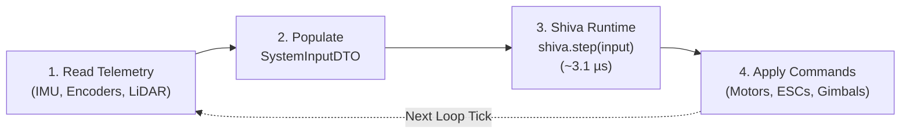
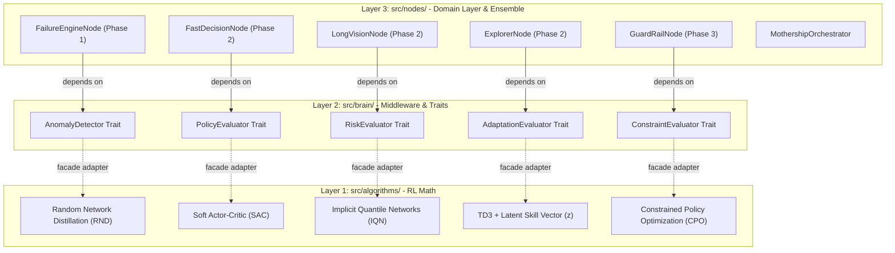
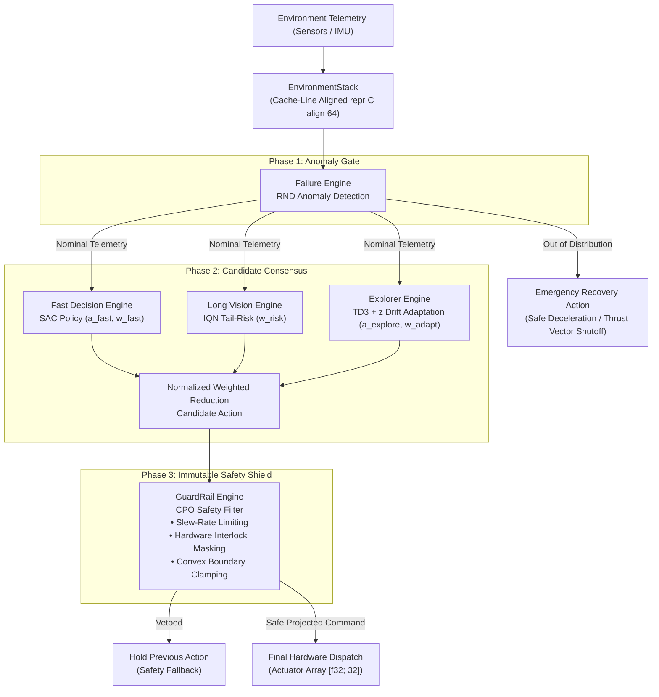

<div align="center">

# shiva.ai
### Sub-Millisecond Autonomous Runtime & Cognitive OS for Robotics, Rocketry & Real-Time Physical Hardware

*"Building AI that doesn't just predict—it perceives, regulates, projects safety, and acts in sub-millisecond real time for autonomous robots, rockets, drones, and physical actuators."*


</div>

---


# Why Shiva for Robotics & Rocketry?

Autonomous physical hardware—whether a **thrust-vectoring rocket engine**, a **quadruped robot**, an **autonomous drone**, or a **high-speed robotic manipulator**—demands control systems that fulfill three uncompromising requirements:

1. **Sub-Millisecond Execution**: Control loops must evaluate in microseconds to maintain stability (e.g., kilohertz gimbal adjustments or motor torque commands). Measured mean cycle latency is **`3.13 µs`** (P99: **`3.67 µs`**).
2. **Zero Latency Spikes (Zero Heap Allocations)**: Dynamic memory allocation (`malloc`, garbage collection) creates unpredictable latency spikes that cause catastrophic physical failures (e.g., rocket RUD or mechanical crash).
3. **Guaranteed Physical Safety Constraints**: Machine learning policies can hallucinate or output extreme actuator commands. Hardware demands hard interlocks, slew-rate limits, and convex boundary safety enforcement.

**Shiva 2.0** is an open-source framework designed specifically for real-time robotic and aerospace control systems. Written in Rust with native C-ABI export bindings, it seamlessly integrates into **Rust, C, C++, Python, ROS / ROS2**, and real-time embedded stacks.

---

# 🚀 Developer Quickstart Guide

Developers can integrate Shiva into any robot, drone, gimbal, or simulation loop in **3 simple steps**:

### Step 1: Build the Shiva Core Engine
```bash
# Clone the repository
git clone https://github.com/Aditya-B-007/Shiva.git
cd Shiva

# Build the optimized release C-ABI dynamic library
cargo build --release
```
*This compiles `target/release/libshiva.dylib` (macOS), `libshiva.so` (Linux), or `shiva.dll` (Windows).*

---

### Step 2: Choose Your Language & Import Shiva

Shiva is plug-and-play across all major programming languages:

#### 🐍 Python Developers (Robotics, Gym, PyBullet, ROS2)
```python
from shiva import ShivaRuntime

# 1. Initialize the 5-node consensus runtime
shiva = ShivaRuntime(matrix_rows=30, min_signal=-1.0, max_signal=1.0)

# 2. Ingest sensor telemetry and get safe motor actions (< 4 microseconds)
input_data = ShivaRuntime.create_default_input()
input_data.state[0] = 0.42     # e.g., Pitch angle / sensor reading
input_data.timestep = 1        # Control loop tick

output = shiva.step(input_data)
print(f"Motor Command: {output.final_action[0]:.4f}")
```

#### 🦀 Rust Developers (Embedded, Real-Time OS)
```rust
use shiva::prelude::*;

let mut shiva = ShivaBuilder::new()
    .with_matrix_rows(30)
    .with_actuator_limits(-1.0, 1.0)
    .build();

let mut input = SystemInputDTO::default();
input.state[0] = 0.42;
input.timestep = 1;

let output = shiva.counter(input);
println!("Motor Command: {:.4}", output.final_action[0]);
```

#### ⚡ C / C++ Developers (Microcontrollers, ROS, Flight Software)
```cpp
#include "cpp/shiva.hpp"

shiva::ShivaRuntime runtime(30, -1.0f, 1.0f);
auto input = shiva::ShivaRuntime::create_default_input();
input.state[0] = 0.42f;
input.timestep = 1;

shiva::OutputPacket output = runtime.step(input);
std::cout << "Motor Command: " << output.final_action[0] << std::endl;
```

---

### Step 3: Plug into Your Real-Time Control Loop

Here is the standard 100 Hz – 10 kHz execution pattern used across all robotics and simulation stacks:



---

# 🛠️ Data Flow & Telemetry Reference

Shiva uses **`#[repr(C, align(64))]`** cache-aligned Data Transfer Objects (DTOs) for zero-copy memory dispatch:

### `SystemInputDTO` (Sensors to Shiva)
| Field | Type | Description |
| :--- | :--- | :--- |
| `state[64]` | `[f32; 64]` | Normalized sensor telemetry (angles, linear velocities, angular rates, distances, temperatures). |
| `setpoint[32]` | `[f32; 32]` | Target reference goals (desired heading, goal altitude, target waypoint coordinates). |
| `hard_boundaries[32]` | `[u8; 32]` | Hardware safety flags (`1` = proximity warning, limit-switch hit, actuator overheat; `0` = normal). |
| `previous_rewards` | `f32` | Performance feedback scalar from the previous step used for continuous policy adaptation. |
| `timestep` | `u64` | Monotonically increasing control loop step count. |

### `ShivaOutputDTO` (Shiva to Hardware Actuators)
| Field | Type | Description |
| :--- | :--- | :--- |
| `final_action[32]` | `[f32; 32]` | Safe, slew-rate-limited, CPO-projected continuous motor commands in $[-1.0, 1.0]$. |
| `mask[32]` | `[u8; 32]` | Actuator channel interlock status (`0` = active output, `1` = channel locked/vetoed for safety). |
| `reward` | `f32` | Instantaneous estimated value / performance metric. |

---

# Example Use Case

https://github.com/user-attachments/assets/b06969f0-133d-4858-97a7-9d479e752aa8

https://github.com/user-attachments/assets/0a3f43a1-c365-4a7b-9844-04c36231ebfe


*From rocket gimbal stabilization & quadrotor landing to multi-joint robotic arm manipulation: Shiva ingests raw sensor telemetry, runs real-time anomaly detection, multi-policy consensus, and CPO safety projection to output deterministic motor commands.*

---

# 🧪 Real-Time Visual Testing & Simulation Harnesses

Shiva includes complete, standalone visual testing and simulation harnesses equipped with **real-time 2D physics visualization**, **active Online Policy Gradient Learning**, and **interactive on-screen control bars**.

Each test runs via a single command with zero complex setup.

```
test/
├── test_inverted_pendulum.py   # Inverted Pendulum (Cart-Pole) Physics & Real-Time Visualizer
└── test_atari_game.py          # Atari Space 2D Interception & Obstacle Avoidance Visualizer
```

### 1. Inverted Pendulum (Cart-Pole Balance Test)
* **Physics Engine**: Full nonlinear cart-pole equations of motion integrated at $50\,\text{Hz}$ via Euler-Cromer physics.
* **Control Objective**: Shiva continuously outputs continuous force commands ($F \in [-12\,\text{N}, +12\,\text{N}]$) to stabilize an inverted pendulum upright ($\theta \approx 0^\circ$) while centering the cart ($x \approx 0$).
* **Online Policy Gradient Learning**: Trajectory rollouts $(s_t, a_t, r_t, \nabla_\theta \log\pi(a_t|s_t))$ are collected and updated at episode boundaries via policy gradient ascent ($\theta \leftarrow \theta + \alpha \sum_t \nabla_\theta \log\pi \cdot A_t$), allowing Shiva to actively adapt and extend balance duration from episode to episode.
* **External Perturbation Testing**: Press **`[⚡ Push Cart]`** to deliver immediate impulse shocks ($\pm 10\,\text{N}$) to verify Shiva's disturbance rejection and balance recovery.

```bash
# Activate your virtual environment
source ../.venv/bin/activate

# Run Inverted Pendulum Visualizer (continuous mode)
python3 test/test_inverted_pendulum.py

# Or run for a fixed episode budget (e.g., 10 episodes)
python3 test/test_inverted_pendulum.py --episodes 10
```

### 2. Atari Game (2D Space Interception & Hazard Avoidance)
* **Game Dynamics**: 2D continuous space interception. Shiva commands $(a_x, a_y)$ continuous thrust vectors to navigate towards collectible green reward orbs ($+10\,\text{pts}$) while dodging red hazard spikes ($-15\,\text{pts}$, 3 lives).
* **Sensor Rays**: Visual telemetry displays live tracking lines to target orbs and proximity warning lasers for nearby obstacles.
* **Online Policy Gradient Learning**: Updates 2D navigation weights upon game-over or episode completion to maximize reward returns.

```bash
# Run Atari Game Visualizer (continuous mode)
python3 test/test_atari_game.py

# Or run for a fixed episode budget (e.g., 25 episodes)
python3 test/test_atari_game.py -e 25
```

### 🎛️ Interactive On-Screen UI Controls

Both test visualizers feature an on-screen top navigation bar:

| UI Button | Shortcut | Description |
| :--- | :---: | :--- |
| **`[Mode: AI / Manual]`** | `Tab` | Switch between Shiva Autonomous 5-Node Control and Manual Keyboard control |
| **`[Train: ON / OFF]`** | `T` | Toggle online policy gradient learning and weight updates on/off |
| **`[Speed: 1x/2x/5x/MAX]`** | — | Accelerate simulation execution rate (real-time 60 FPS up to unlocked MAX) |
| **`[Eps: ∞ / 3 / 5 / 10 / 25]`** | — | Dynamically cycle target episode limit during execution |
| **`[⚡ Push Cart]`** | `P` | Apply an external impulse shock to test disturbance rejection (Inverted Pendulum) |
| **`[Pause / Resume]`** | `Space` | Pause simulation to inspect state vectors, actions, and telemetry |
| **`[Reset]`** | `R` | Reset simulation state and start a fresh episode |
| **`[HUD: ON / OFF]`** | `H` | Toggle consensus telemetry and sensor debug overlays |

### ⚡ Headless Benchmark Mode
To run automated multi-episode benchmarks without opening a GUI window:
```bash
# Benchmark 50 episodes of Inverted Pendulum
python3 test/test_inverted_pendulum.py --headless --episodes 50

# Benchmark 50 episodes of Atari Game
python3 test/test_atari_game.py --headless --episodes 50
```

---

# Key Framework Capabilities

### ⚡ Sub-Millisecond & Zero-Allocation Execution
- **`#[repr(C, align(64))]` Memory Alignment**: `EnvironmentStack` memory buffers are cache-line aligned and stored statically or on the stack.
- **Zero Dynamic Heap Allocations**: Hot execution paths operate completely without `Vec` or `Box` allocations during real-time loops.
- **Microsecond Control Loop**: Tailored for high-frequency hardware systems operating at 100 Hz to 10 kHz.

### 🛡️ 3-Phase Safety Consensus Pipeline
1. **Phase 1: Anomaly Gate (Failure Engine / RND)**
   - Measures out-of-distribution state prediction error $E(S_t)$ in real time.
   - If an unexpected state occurs (e.g., sensor failure, extreme aerodynamic disturbance), it immediately **bypasses policy execution** and dispatches a pre-compiled safe emergency recovery action ($a_{\text{emergency}}$).
2. **Phase 2: Unconstrained Candidate Consensus**
   - **Fast Decision Engine (SAC)**: Computes baseline motor action $a_{\text{fast}}$ and confidence weight $w_{\text{fast}}$.
   - **Long Vision Engine (IQN)**: Computes multi-step tail risk (CVaR) to produce a risk-adjusted weight $w_{\text{risk}}$.
   - **Explorer Engine (TD3 + z)**: Decodes latent skill vectors $z \in \mathbb{R}^{16}$ to compensate for physical drift (e.g., mass loss, friction shift, wind gusts) yielding $a_{\text{explore}}$ and $w_{\text{adapt}}$.
   - **Normalized Reduction**: Combines proposals without torque loss or signal attenuation.
3. **Phase 3: Immutable Safety Shield (GuardRail Engine / CPO)**
   - **Slew-Rate Limiting**: Enforces $|\Delta a_t| \le \Delta_{\text{max}}$ to prevent actuator chatter and mechanical fatigue.
   - **Hardware Rule-Mask Filtering**: Applies hardware safety interlocks (zeroing out commands on locked/faulted channels).
   - **Convex Boundary Projection**: Clamps output commands strictly to $[-1.0, 1.0]$.
   - **Veto Fallback**: Reverts to previous safe state if candidate actions violate hard safety bounds.

---

# Decoupled Architecture

Shiva enforces the **Dependency Inversion Principle** across three distinct layers. Domain execution nodes depend *only* on abstract trait contracts, never directly on RL algorithm implementations.



---

# Consensus Pipeline Architecture



---

# Codebase Structure

```
Shiva/
├── Cargo.toml                  # Rust Crate Manifest (cdylib + staticlib + rlib)
├── README.md                   # System Architecture & Documentation
├── bindings/                   # Cross-Language Language Bindings
│   ├── c/                      # C99 Header (shiva.h)
│   ├── cpp/                    # C++17 Header-Only Wrapper (shiva.hpp)
│   └── python/                 # Python C-types Wrapper (shiva.py)
├── examples/                   # Framework Integration Examples
│   ├── basic_control_loop.rs   # Rust Control Loop Example
│   ├── c_example.c             # C Integration Example
│   ├── cpp_example.cpp         # C++ Integration Example
│   └── python_example.py       # Python Integration Example
├── test/                       # Real-Time Visual Test Harnesses
│   ├── test_inverted_pendulum.py # Cart-Pole Balance & Online Learning Visualizer
│   └── test_atari_game.py      # Atari 2D Space Interception & Online Learning Visualizer
└── src/
    ├── lib.rs                  # Crate Root & Prelude Re-exports
    ├── config.rs               # Framework Configuration & ShivaBuilder
    ├── ffi.rs                  # C-ABI Extern FFI Exports (shiva_create, shiva_step, etc.)
    ├── algorithms/             # Layer 1: Pure RL Mathematical Implementations
    │   ├── mod.rs
    │   ├── softActorCriticNetwork.rs   # SAC Policy & Twin Critic
    │   ├── cpo.rs                      # Constrained Policy Optimization
    │   ├── implicitQuantileNetworks.rs  # IQN Distributional Quantiles
    │   ├── td3.rs                      # TD3 + Latent Skill Embeddings (z)
    │   └── rnd.rs                      # RND Curiosity & Anomaly Detector
    ├── brain/                  # Layer 2: Middleware & Facade Adapters
    │   ├── mod.rs
    │   ├── core/
    │   │   ├── dto.rs          # Cache-Aligned C DTOs (#[repr(C, align(64))])
    │   │   └── traits.rs       # Core Trait Interfaces (Policy, Safety, Anomaly)
    │   ├── policy/             # SacPolicyAdapter
    │   ├── constraint/         # CpoConstraintAdapter
    │   ├── risk/               # IqnRiskAdapter
    │   ├── skill_vault/        # Td3SkillAdapter
    │   └── anomaly/            # RndAnomalyAdapter
    ├── environment/            # Memory & Dispatch Buffers
    │   ├── environmentMatrix.rs # Sliding Window State Store & RBAC Matrix
    │   └── actuatorSignal.rs   # Hardware Staging & Dispatch Buffer
    ├── nodes/                  # Layer 3: Domain Execution & Orchestrator
    │   ├── core/
    │   │   └── shared_state.rs # EnvironmentStack C-Contiguous Memory
    │   ├── failure_engine/     # Phase 1: FailureEngineNode
    │   ├── fast_decision/      # Phase 2: FastDecisionNode
    │   ├── long_vision/        # Phase 2: LongVisionNode
    │   ├── explorer/           # Phase 2: ExplorerNode
    │   ├── guardrail/          # Phase 3: GuardRailNode
    │   └── orchestrator/       # MothershipOrchestrator Pipeline
    └── protocol/               # Protocol & Ingestion Interfaces
        ├── systemSide.rs       # SystemInputDTO
        ├── shivaSide.rs        # ShivaOutputDTO
        └── middleMan.rs        # ManInTheMiddle Protocol Manager
```

---

# Contributing

Shiva is an open-source research and engineering framework. We welcome contributions across Robotics, Rocketry, Control Theory, Reinforcement Learning, Real-Time Embedded Systems, and Systems Programming.
