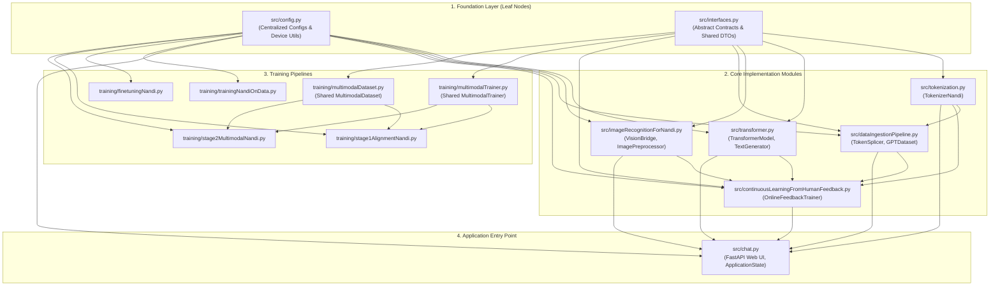
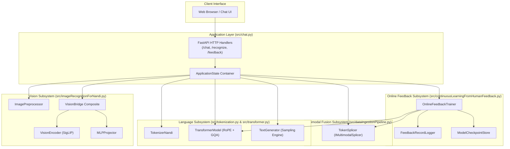
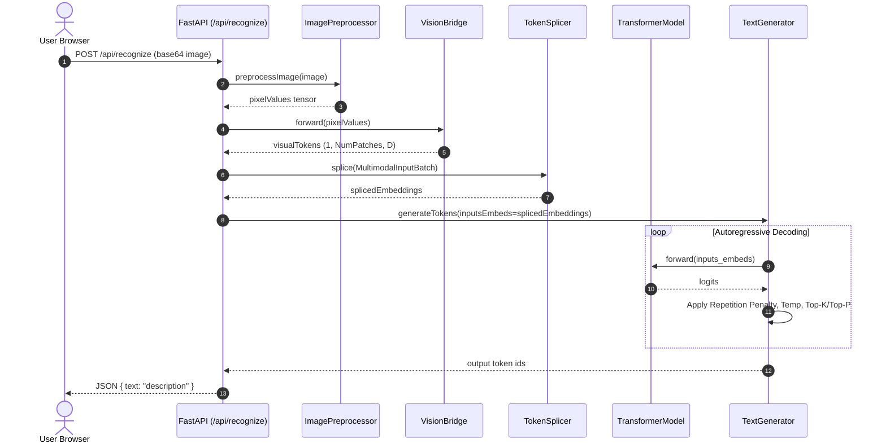
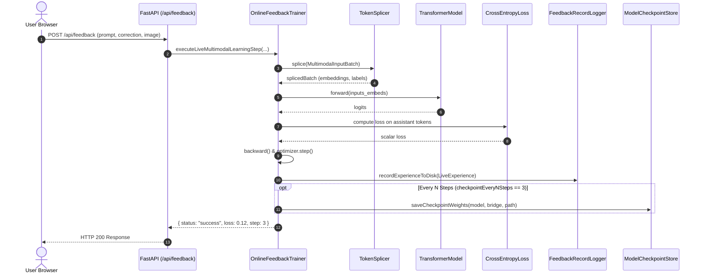

# 🐂 Nandi

**Nandi** is a lightweight, domain-specialized Small Language Model (SLM) designed to bridge the user interface with **Shiva.ai**'s control and orchestration systems. Built with modern transformer innovations, Nandi provides fast, efficient token generation and reasoning for domain-specific control tasks.


---

## 🏗️ Architectural Overview

Nandi uses a modern **Causal Decoder-Only Transformer** built for speed, stability, and reasoning capabilities:

* **Positional Embeddings**: **RoPE (Rotary Position Embeddings)** applied to queries and keys across all attention heads for superior context and length extrapolation.
* **Attention Kernel**: **PyTorch Scaled Dot-Product Attention (`F.scaled_dot_product_attention`)**, natively leveraging FlashAttention where supported with causal masking.
* **Normalization**: **Pre-Layer Normalization (Pre-LN)** with a final `nn.LayerNorm` prior to the language modeling head for deep network training stability.
* **Activation**: **GELU** (Gaussian Error Linear Unit) inside the Feed-Forward Network.
* **Weight Tying**: Shared weights between input embedding and the output projection matrix (`self.decoder.weight = self.encoder.weight`) to conserve memory and enhance representations.
* **Initialization**: **Orthogonal initialization** across weight matrices with normalized LayerNorm parameters.
* **Reasoning Ready**: Native support for `<|thought|>` delimiter tokens and step-by-step reasoning sequences.

---

## 📂 Project Structure

```text
Shiva/
├── data/
│   ├── data.txt                      # 9.1 MB domain text corpus (architecture, code, robotics)
│   ├── nandiTrain.jsonl              # 500 curated Q&A pairs with thoughts & human-readable responses
│   ├── multimodalTrain.jsonl         # Multimodal image-caption alignment data
│   └── liveConversations.jsonl       # Persistent human feedback logs
│
├── model_artifacts/
│   ├── tokeniser/                    # Serialized BPE tokenizer model (tokeniser.json)
│   └── checkpoints/                  # Saved model & projector checkpoints
│
├── src/
│   ├── interfaces.py                 # Single source of truth for all ABCs and shared DTOs
│   ├── config.py                     # Centralized configs, dataclasses, and device utility
│   ├── tokenization.py               # Custom Byte-Level BPE Tokenizer (TokenizerNandi)
│   ├── transformer.py                # 30.2M RoPE + FlashAttention Causal Transformer & TextGenerator
│   ├── imageRecognitionForNandi.py   # VisionEncoder, MLPProjector, VisionBridge, ImagePreprocessor
│   ├── dataIngestionPipeline.py      # Chunked PyTorch Dataset, TokenSplicer & DataLoader pipeline
│   ├── continuousLearningFromHumanFeedback.py # OnlineFeedbackTrainer, FeedbackRecordLogger, ModelCheckpointStore
│   └── chat.py                       # FastAPI Web UI with typed ApplicationState
│
├── training/
│   ├── multimodalTrainer.py          # Shared MultimodalTrainer & MaskedCausalLMLoss
│   ├── multimodalDataset.py          # Shared MultimodalDataset
│   ├── trainingNandiOnData.py        # Stage 1: Pre-training on domain corpus with MPS acceleration
│   ├── finetuningNandi.py            # Stage 2: Supervised Fine-Tuning (SFT) on Q&A reasoning pairs
│   ├── stage1AlignmentNandi.py       # Stage 3A: Projector alignment warmup
│   └── stage2MultimodalNandi.py      # Stage 3B: End-to-end multimodal fine-tuning
│
└── README.md
```

---

## ⚙️ Model Specifications (Lightweight SLM)

| Parameter | Value | Description |
| :--- | :--- | :--- |
| `ntoken` | `9,714` (custom domain BPE) | Vocabulary size |
| `ninp` (`d_model`) | `512` | Hidden representation dimension |
| `nhead` | `8` | Attention heads (`head_dim = 64`) |
| `nhid` | `2048` | MLP hidden feed-forward dimension |
| `nlayers` | `8` | Transformer blocks (optimized for thermals & throughput) |
| `dropout` | `0.1` | Dropout rate |
| `max_seq_len` | `8192` | RoPE precomputed cache capacity |
| **Embedding Table** | **4.97M params** | Only 16.5% of model (tied `decoder.weight = encoder.weight`) |
| **Transformer Core**| **25.18M params** | 83.5% of capacity dedicated to causal attention & reasoning |
| **Total Parameters** | **30,156,800 (~30.2M)** | Fast & cool training on Apple Silicon, Intel, or NVIDIA GPUs |
| **Batch Convention** | `(batch_size, seq_len)` | Standard `batch_first=True` |

---


## 🚀 Quickstart

### 1. Requirements

Ensure you have Python 3.9+ and PyTorch installed:

```bash
pip install torch tokenizers
```

### 2. Tokenizer Training & Testing

The tokenizer uses Byte-Level BPE with custom special tokens (`<unk>`, `<pad>`, `</s>`, `<|thought|>`):

```bash
python3 src/tokenization.py
```

### 3. Data Ingestion Pipeline

To verify the sliding window chunking and batch creation:

```bash
python3 src/dataIngestionPipeline.py
```

### 4. Running the Model Core

Run the model script directly to inspect parameter count and test a forward pass:

```bash
python3 src/transformer.py
```

### 5. Stage 1: Base Language Pre-Training

Train the base causal language model on domain text (`data/data.txt`):

```bash
python3 training/trainingNandiOnData.py
```

Checkpoints will be saved automatically to `model_artifacts/checkpoints/nandi_final.pt`.

### 6. Stage 2: Supervised Fine-Tuning (SFT) on Q&A / Reasoning Data

Fine-tune the pre-trained weights on the curated question-and-answer pairs with `<|thought|>` reasoning traces:

```bash
python3 training/finetuningNandi.py
```

Checkpoints will be saved to `model_artifacts/checkpoints/nandi_chat_final.pt`.

### 7. Stage 3: Vision-Language Alignment & Multimodal Training

Train the SigLIP vision bridge and multimodal reasoning capabilities on images:

```bash
# Stage 3A: Alignment warmup (SLM backbone frozen, train MLP Projector only)
python3 training/stage1AlignmentNandi.py

# Stage 3B: End-to-end multimodal fine-tuning (Joint SLM + Projector training)
python3 training/stage2MultimodalNandi.py
```

Checkpoints:
- Stage 1 outputs to `model_artifacts/checkpoints/nandi_stage1_projector.pt`
- Stage 2 outputs final weights to `model_artifacts/checkpoints/nandi_vision_final.pt`

### 8. End-to-End Testing & Verification

Run the full end-to-end verification suite covering text generation, SigLIP vision encoding, multimodal splicing, and optimization convergence:

```bash
python3 tests/test_end_to_end_pipeline.py
```

### 9. Interactive Chat & Vision UI

Launch the ChatGPT-style interface with pure image recognition & chat:

```bash
python3 src/chat.py
```

---

## 🧠 Reasoning & CoT (Chain of Thought)

Nandi incorporates `<|thought|>` delimiters within its tokenization vocabulary and data pipelines to support multi-step reasoning traces prior to final solution dispatch.

---

## 🏛️ Architecture & System Diagrams

### 1. Module & File Dependency Graph (DAG)

The codebase strictly follows the **Stable Dependencies Principle (SDP)**. Dependencies flow unidirectionally from higher-level application and training scripts down through core models and into pure foundation interfaces and configuration leaves:



---

### 2. Component Diagram

Nandi's runtime is partitioned into decoupled subsystems communicating through clear interface boundaries:



---

### 3. Class Diagram (Clean Architecture & SOLID Contracts)

Every business-critical capability is governed by abstract base classes defined in `src/interfaces.py`, upholding the **Dependency Inversion Principle (DIP)** and **Interface Segregation Principle (ISP)**:

```mermaid
classDiagram
    class ITokenizer {
        <<interface>>
        +encode(text)
        +decode(tokenIds, skipSpecialTokens)
        +getVocabSize() int
    }
    class ITrainableTokenizer {
        <<interface>>
        +train(corpusPath)
        +load()
        +addSpecialTokens(tokens) int
    }
    ITrainableTokenizer --|> ITokenizer
    TokenizerNandi ..|> ITrainableTokenizer

    class ITextGenerator {
        <<interface>>
        +generateTokens(tokenIndices, inputsEmbeds, ...) Tensor
    }
    TextGenerator ..|> ITextGenerator
    TransformerModel o-- TextGenerator

    class IVisionEncoder {
        <<interface>>
        +hiddenDim int
        +extractFeatures(pixelValues) Tensor
    }
    VisionEncoder ..|> IVisionEncoder
    VisionEncoderFactory ..> VisionEncoder : creates

    class IImagePreprocessor {
        <<interface>>
        +getImageTransform(targetImageSize)
        +preprocessImage(rawImageInput, targetImageSize) Tensor
    }
    ImagePreprocessor ..|> IImagePreprocessor
    imageRecognitionEmbedder o-- IImagePreprocessor

    class IProjector {
        <<interface>>
        +project(visualFeatures) Tensor
    }
    MLPProjector ..|> IProjector
    VisionBridge o-- IVisionEncoder
    VisionBridge o-- IProjector

    class IMultimodalSplicer {
        <<interface>>
        +splice(batch) SplicedMultimodalOutput
    }
    TokenSplicer ..|> IMultimodalSplicer

    class ILossEvaluator {
        <<interface>>
        +evaluate(logits, labels) Tensor
    }
    MaskedCausalLMLoss ..|> ILossEvaluator
    MultimodalTrainer o-- IMultimodalSplicer
    MultimodalTrainer o-- ILossEvaluator

    class IFeedbackLog {
        <<interface>>
        +recordExperienceToDisk(experience, imageRelativePath)
        +loadReplayBufferSamples(maxSampleCount) list
    }
    class ICheckpointStore {
        <<interface>>
        +saveCheckpointWeights(languageModel, visionBridge, targetFilePath)
    }
    FeedbackRecordLogger ..|> IFeedbackLog
    ModelCheckpointStore ..|> ICheckpointStore
    OnlineFeedbackTrainer o-- IFeedbackLog
    OnlineFeedbackTrainer o-- ICheckpointStore

    class ApplicationState {
        +languageModel TransformerModel
        +textGenerator ITextGenerator
        +visionBridge VisionBridge
        +visionEncoder VisionEncoder
        +imagePreprocessor IImagePreprocessor
        +tokenSplicer IMultimodalSplicer
        +tokenizer ITokenizer
        +onlineTrainer OnlineFeedbackTrainer
    }
```



---

### 4. Sequence Diagram: Multimodal Inference Flow

Execution timeline when an image recognition request is received by `src/chat.py` (`POST /api/recognize`):



---

### 5. Sequence Diagram: Continuous Learning from Human Feedback Flow

Execution timeline when a human operator provides a response correction via the UI (`POST /api/feedback`):




